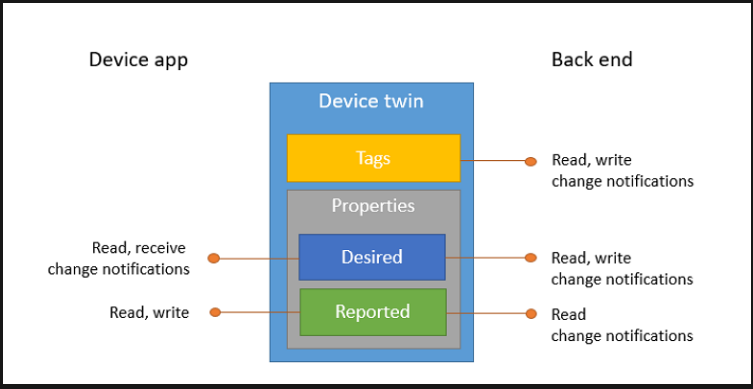

# Implementing IoT Infrastructure

The top four reasons for companies to utilize IoT are Operations optimization, improvement of employee productivity, safety and security.

## Azure IoT Hub

IoT Hub is a managed service, hosted in the cloud, that acts as a central message hub for bi-directional communication between your IoT solutions and the devices it manages.

IoT Hub enables highly secure and reliable communication between your IoT solution and the devices it manages. Azure IoT Hub provides a cloud-hosted solution backend to connect IoT devices. IoT Hub allows you to extend your solution from the cloud to the edge with per-device authentication, built-in device management, and scaled provisioning. IoT Hub supports communications both from the device to the cloud and from the cloud to the device. IoT Hub supports multiple messaging patters such as device-to-cloud telemetry, file upload from devices, and request-reply methods to control your devices from the cloud. IoT Hub monitoring helps you maintain the health of your solution by tracking events such as device creation, device failures and device connections.

IoT Hub's capabilities help you build scalable, full-featured IoT solutions such as managing industrial equipment used in manufacturing, tracking valuable assets in healthcare, and monitoring office building usage.

IoT Hub scales to millions of simultaneously connected devices and millions of events per second to support your IoT workloads.

### IoT Hub Security

IoT Hub gives you a secure communication channel for your devices to send data.

- Per-device authentication enables each device to connect securely to IoT Hub and for each device to be managed securely
- You have complete control over device access and can control connections at the per-device level
- The IoT Hub Device Provisioning Service automatically provisions devices to the right IoT Hub when the device first boots up
- Multiple authentication types support a variety of device capabilities
  - SAS token-based authentication to quickly get started with your IoT solution.
  - Individual X.509 certificate authentication for secure, standards-based authentication.
  - X.509 CA authentication for simple, standards-based enrollment.

### Route device data

Built-in message routing functionality gives you flexibility to set up automatic rule-bases message fan-out

- Use message routing to control where your hub sends device telemetry
- There is no additional cost to route messages to multiple endpoints
- No-code routing rules take the place of custom message dispatcher code

### Integrate with other services

You can integrate IoT Hub with other Azure services to build complete, end-to-end solutions.

- Azure Event Grid to enable your business to react quickly to critical events in a reliable, scalable, and secure manner.
- Azure Logic Apps to automate business processes.
- Azure Machine Learning to add machine learning and AI models to your solution.
- Azure Stream Analytics to run real-time analytic computations on the data streaming from your devices.

### Configure and control your devices

You can manage your devices connected to IoT Hub with an array of built-in functionality.

- Store, synchronize, and query device metadata and state information for all your devices.
- Set device state either per-device or based on common characteristics of devices.
- Automatically respond to a device-reported state change with message routing integration.

### Connecting devices

Use the Azure IoT device SDK libraries to build applications that run on your devices and interact with IoT Hub. Supported platforms include multiple Linux distributions, Windows, and real-time operating systems. Supported languages include:

- C
- C#
- Java
- Python
- Node.js.

IoT Hub and the device SDKs support the following protocols for connecting devices

- HTTPS
- AMQP
- AMQP over WebSockets
- MQTT
- MQTT over WebSockets

### How IoT Hub Works

Azure IoT Hub is the main Azure PaaS (Platform as a Service) which enables bidirectional communications between IoT devices and a cloud solution. IoT Hub is the starting point for any IoT solution, and it implements some essential functions that are common to IoT deployments. These include networking, compute, storage capabilities and security. We describe these features below.

**Protocols supported**: IoT Hub allows devices to use the following protocols for device-side communications: MQTT, MQTT over WebSockets, AMQP, AMQP over WebSockets and HTTPS

**Device Identity Registry**: IoT Hub maintains an identity registry. The identity registry stores information about the devices and modules permitted to connect to the IoT Hub. An identity registry entry for the device or module must exist before the entity can connect to the IoT Hub. A device or module must also authenticate with the IoT Hub based on credentials stored in the identity registry.

**Authentication**: Azure IoT Hub grants access to endpoints by verifying a token against the shared access policies and identity registry security credentials. You can use any X.509 certificate to authenticate a device with IoT Hub. Supported certificates include an existing X.509 certificate; CA-signed X.509 certificate; a self-generated and self-signed X-509 certificate.

**Device twins**: Device twins are JSON documents that store device state information, including metadata, configurations, and conditions. Azure IoT Hub maintains a device twin for each device that you connect to IoT Hub. Device twins store device-related information that Device and back ends can use to synchronize device conditions and configuration.

**Endpoints that IoT Hub exposes**: For each device in the identity registry, IoT Hub exposes a set of endpoints: Send device-to-cloud messages; Receive cloud-to-device messages; Initiate file uploads; Retrieve and update device twin properties; Receive direct method requests. IoT Hub currently supports the following Azure services as additional (custom) endpoints: Azure Storage containers, Event Hubs, Service Bus Queues, Service Bus Topics.

**Provisioning devices with Azure IoT Hub Device Provisioning Service**: The IoT Hub Device Provisioning Service is a helper service for IoT Hub. The device provisioning service enables zero-touch, just-in-time provisioning to the right IoT Hub without requiring human intervention, allowing the customers to provision millions of devices in a secure and scalable manner.

**The telemetry** function is the essential component of the IoT Hub. The telemetry function involves recording and transmitting values received by an IoT device. However, IoT Hub is much more than the basic telemetry function. The scaling feature of the IoT Hub allows you to ramp up (or down) the scope of the solution. The ability to scale a solution depends on two considerations: the features you plan to use and the amount of data you plan to move daily. Once you plan to deploy devices at scale, you need to manage these devices. The provisioning function of IoT hub enables you to manage devices across the lifecycle of a device. Provisioning also establishes the security protocols for the device, its access rights, and privileges. The security requirements can be seen as part of a security function, which manages the per-device authentication and access requirements with multiple authentication types. Based on the security functions, the routing function determines the message flow and the recipients of the message. Finally, you can connect to external devices natively using the SDK functionality and integrate with other services using the service integration functionality.

## Configure a device twin

Device twins are JSON documents that store device state information including metadata, configurations, and conditions. Azure IoT Hub maintains a device twin for each device that you connect to IoT Hub.

Use device twins to:

- Store device-specific metadata in the cloud. For example deployment location of a vending machine
- Report current state information such as available capabilities and conditions from your device app
- Synchronize the state of long-running workflows between device app and back-end app.
- Query your device metadata, configuration or state

The lifecycle of a device twin is linked to the corresponding device identity. Device twins are implicitly created and deleted when a device identity is created or deleted in IoT Hub.

A device twin is a JSON document that includes:

- **Tags**: A section of the JSON document that the solution back end can read from and write to. Tags are not visible to device apps.
- **Desired properties**: Used along with reported properties to synchronize device configuration or conditions. The solution back end can set desired properties, and the device app can read them. The device app can also receive notifications of changes in the desired properties.
- **Reported properties**: Used along with desired properties to synchronize device configuration or conditions. The device app can set reported properties and the solution back end can read and query them.
- **Device identity properties** - The root of the device twin JSON document contains the read-only properties from the corresponding device identity stored in the identity registry.



```JSON
{
    "deviceId": "devA",
    "etag": "AAAAAAAAAAc=",
    "status": "enabled",
    "statusReason": "provisioned",
    "statusUpdateTime": "0001-01-01T00:00:00",
    "connectionState": "connected",
    "lastActivityTime": "2015-02-30T16:24:48.789Z",
    "cloudToDeviceMessageCount": 0,
    "authenticationType": "sas",
    "x509Thumbprint": {
        "primaryThumbprint": null,
        "secondaryThumbprint": null
    },
    "version": 2,
    "tags": {
        "$etag": "123",
        "deploymentLocation": {
            "building": "43",
            "floor": "1"
        }
    },
    "properties": {
        "desired": {
            "telemetryConfig": {
                "sendFrequency": "5m"
            },
            "$metadata" : {...},
            "$version": 1
        },
        "reported": {
            "telemetryConfig": {
                "sendFrequency": "5m",
                "status": "success"
            },
            "batteryLevel": 55,
            "$metadata" : {...},
            "$version": 4
        }
    }
}

```

### Back-end operations on devices

The solution back end operates on the device twin using the following atomic operations, exposed through HTTPS:

- Retrieve device twin by ID
- Partially update device twin
- Replace desired properties
- Replace tags
- Receive twin notifications

### Device operations

The device app operates on the device twin using the following atomic operations:

- Retrieve device twin
- Partially update reported properties
- Observe desired properties

IoT Hub enforces an 8KB size limit on the value of `tags` and a 32 KB size limit each on the value of `properties/desired` and `properties/reported`. These totals are exclusive of read-only elements.

IoT Hub maintains the timestamp of the last update for each JSON object in device twin desired and reported properties.
